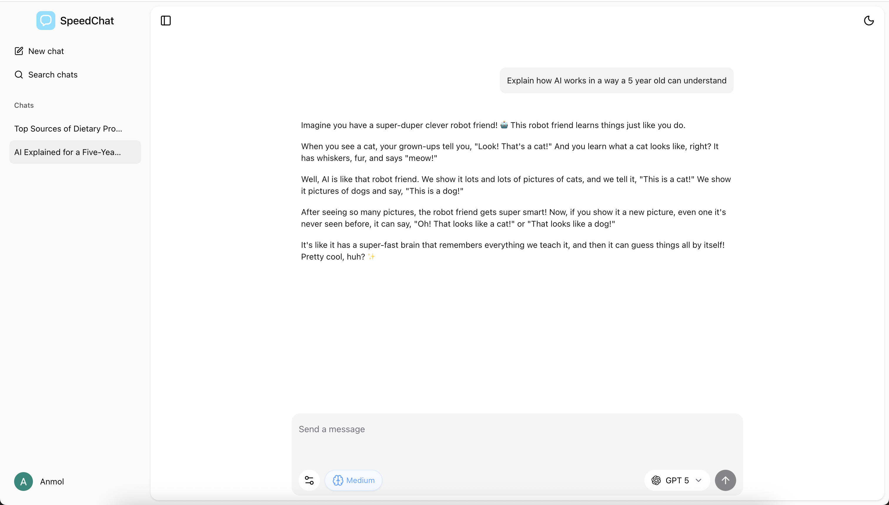

# Speed Chat

An AI chat application built with Next.js 15, Convex, and AI SDK v5, featuring multiple AI models, image upload support, AI powered web search with Exa, and resumable streams.

## Demo

[Live Website](https://speed-chat-lake.vercel.app/)



## 🤖 AI Models Supported

- **OpenAI** - GPT 5, GPT 5 mini
- **Anthropic** - Claude Sonnet 4, Claude Opus 4.1
- **Google** - Gemini 2.5 Flash, Gemini 2.5 Pro

## 🚀 Features

- **Multiple AI Models** - Support for OpenAI, Anthropic, Google models via Vercel AI Gateway
- **Web Search Integration** - Enhanced responses with real-time web search using Exa
- **Image Upload Support** - Upload and send images with your messages
- **Persistent Chat History** - Fully synced chat history to use across devices
- **Branching Conversations** - Create a new chat from an existing message in a chat
- **Search Chats** - Search through your chat history and messages
- **Formatting** - Beautiful formatting of code, latex, tables in AI responses to improve chat experience
- **Resumable Streams** - Streams automatically resume when page is refreshed or client loses connection

## 🛠 Tech Stack

- [Next.js 15 App Router](https://nextjs.org) - Full stack React framework with server components/actions and api routes
- [React 19](https://react.dev) - Latest React
- [Convex](https://www.convex.dev) - Reactive backend as a service platform
- [Better Auth Convex Integration](https://convex-better-auth.netlify.app/) - Comprehensive auth library
- [TailwindCSS v4](https://tailwindcss.com) - Inline CSS framework
- [shadcn/ui](https://ui.shadcn.com) - Modern component library built on Radix UI
- [AI SDK](https://ai-sdk.dev) - Typescript AI toolkit to build AI applications
- [Exa](https://exa.ai) - AI powered web search API

## 📦 Getting Started

1. Clone the repository and install dependencies:

```bash
git clone https://github.com/anmhrk/speed-chat.git
cd speed-chat
bun install # or whatever package manager you prefer
```

2. Start the development server:

```bash
bun run dev # app will be available at http://localhost:3000
```

3. Setup + start the Convex development server:

```bash
bun run convex:dev # this will auto set the required env vars for you too
```

4. Follow the instructions in the [Convex + Better Auth](https://convex-better-auth.netlify.app/) guide to set up auth.

5. Make sure you have setup all the env vars in `.env.example` in your `.env.local` file.

## 📄 License

[MIT](LICENSE)
